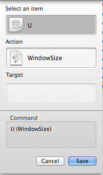
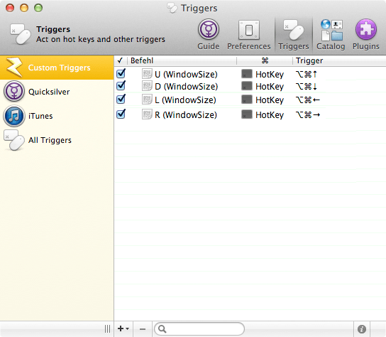

# WindowSiza

A cute window layouting tool written in pure AppleScript.

## The Problem
Meet lovable entrepreneur and programmer Mittens McFur. Having scratched the surface of CouchDB, he's ready to kick-start his first big project. But not so fast! First he has to resize his windows to use his screen space efficiently. Dragging all those windows around by paw makes him a mad kitty. God gave him nine lives, but no patience. He wants to slam his paw on the keyboard!

Now, compared to your average cat, Mittens has a strong sense for productivity. There must be a better way.

## The Solution
With WindowSiza, the perfect window layout is just a few paw-slams away! Using shortcuts for up, down, left and right, you can easily move windows to the left half of the screen, the bottom right, or anywhere else. Suddenly, arranging windows is as playful as hunting mice.

## Why this is better than all other tools
It's not. Functionality is limited, but most other tools need to run in the background as some kind of daemon. McFur is afraid of daemons. Doesn't like 'em one bit. WindowSiza works together with [Quicksilver](http://qsapp.com), so you can use keyboard shortcuts without it running the whole time. McFur is way into [centralism](http://en.wikipedia.org/wiki/Democratic_centralism), so having one command center instead of many one-trick-pony apps makes him purr.

## But seriously, how to use this?
1. Install [Quicksilver](http://qsapp.com)
2. Put *WindowSiza.scpt* in *~/Library/Application Support/Quicksilver/Actions/*
3. Restart Quicksilver
4. in Quicksilver's preferences, under *Triggers* → *Custom Triggers*, click the plus at the bottom to create a new *Hot Key* trigger.
5. In the dialog, enter `.U` in the first field (the dot and the capital u), and in the second field select *WindowSiza*. Click *Save*:

6. Repeat the last step, but enter `.D`, `.L` and `.R` in the first field.
7. You'll now have four new entries. Select the first of them and click the `i` icon at the bottom right. In the drawer that opens, you can assign a keyboard shortcut. I chose Cmd+Alt + the arrow keys.

The end result should look like this:

You can now put the front window to different preset positions on the screen by pressing these shortcuts.

## License
Of course, all of Mitt's stuff is MIT-licensed.
